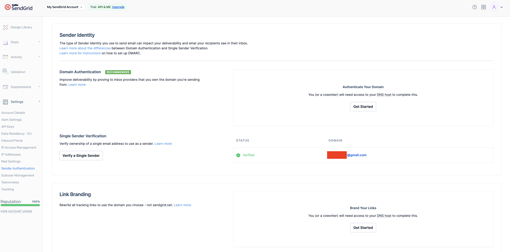
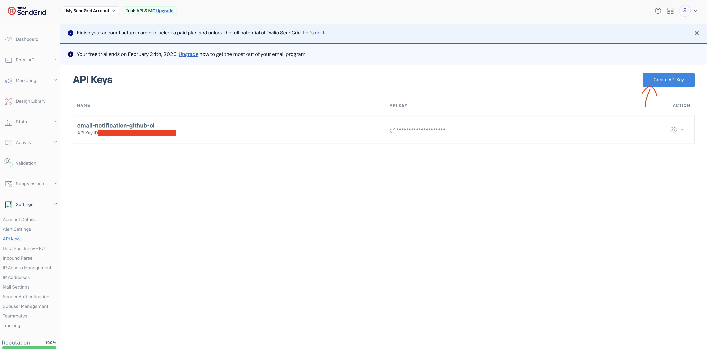
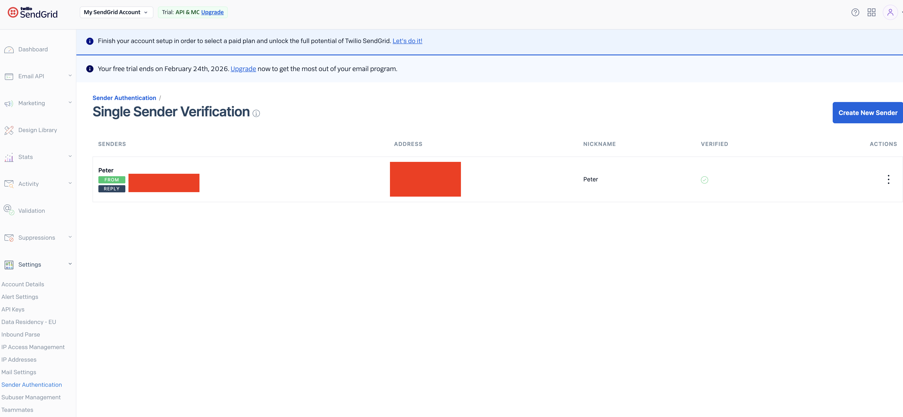

# EMAIL NOTIFICATION ✉️

## SENDGRID

- create account
- verified domain/sender https://app.sendgrid.com/settings/sender_auth 
- add api key https://app.sendgrid.com/settings/api_keys 
  - assign permissions
    - ✅ Mail Send (Full Access)
- add single sender https://app.sendgrid.com/settings/sender_auth/senders 
- set api key as secret in github
- make the workflow, example: [email-notification.yml](../.github/workflows/email-notification.yml)

to test sending email:
- set environment variables for SENDGRID, the file is generated with `npm run make-env `
- run:
  - npm run build:ci:scripts
  - npm run email:send-email


## Sendgrid via SMTP less recommended

Example Job using SMTP Sendgrid not recommended and only for text plain since html_body did not work or take a look on this one:
```yml
name: Notify Email on failure

on:
  workflow_call:
    inputs:
      report_artifact:
        required: true
        type: string
      body_file:
        required: true
        type: string

jobs:
  email-notify:
    runs-on: ubuntu-latest

    steps:
      - name: Checkout repository
        uses: actions/checkout@v4 
      - name: Install node
        uses: actions/setup-node@v4
        with:
          node-version: lts/*

      - name: Download test report
        uses: actions/download-artifact@v4
        with:
          name: ${{ inputs.report_artifact }}
          path: playwright-report/visual

      - name: Filter existing attachments
        run: |
          ls playwright-report/visual || true

      - name: Prepare Email Info
        run: |
          echo "GITHUB_REPOSITORY=${{ github.repository }}" >> $GITHUB_ENV
          echo "GITHUB_RUN_URL=${{ github.server_url }}/${{ github.repository }}/actions/runs/${{ github.run_id }}" >> $GITHUB_ENV
          echo "GITHUB_WORKFLOW=${{ github.workflow }}" >> $GITHUB_ENV
          echo "AUTHOR=${{ github.event.pull_request.user.login || github.actor}}" >> $GITHUB_ENV
          echo "PR_URL=${{ github.event.pull_request.html_url }}" >> $GITHUB_ENV
          echo "PR_NUMBER=${{ github.event.pull_request.number }}" >> $GITHUB_ENV
          echo "PR_TITLE=${{ github.event.pull_request.title }}" >> $GITHUB_ENV
          echo "SOURCE_BRANCH=${{ github.event.pull_request.head.ref }}" >> $GITHUB_ENV
          echo "DESTINATION_BRANCH=${{ github.event.pull_request.base.ref }}" >> $GITHUB_ENV

      - name: Build CI scripts and generate assets
        run: |
          npm ci
          npm run build:ci:scripts
          npm run email:generate-body

      - name: Debug html file
        run: cat dist/assets/visual-tests-body.html

      - name: Send email via Sendgrid
        uses: dawidd6/action-send-mail@v3
        with:
          server_address: smtp.sendgrid.net
          server_port: 587
          username: apikey
          password: ${{ secrets.SENDGRID_API_KEY_TEST }}
          subject: "❌ CI failed"
          to: ${{ secrets.SENDGRID_EMAIL_TO }}
          #Procure use this fortmat to send the email
          from: "ALIAS <YOUR-EMAIL@gmail.com>"
          body: The pipeline failed.
          #html_body: file://${{ inputs.body_file }}
          #path should exists, in this case is generated by the step "Download test report"
          attachments: |
            playwright-report/visual/index.html
            playwright-report/visual/report.json
            playwright-report/visual/report.xml

```