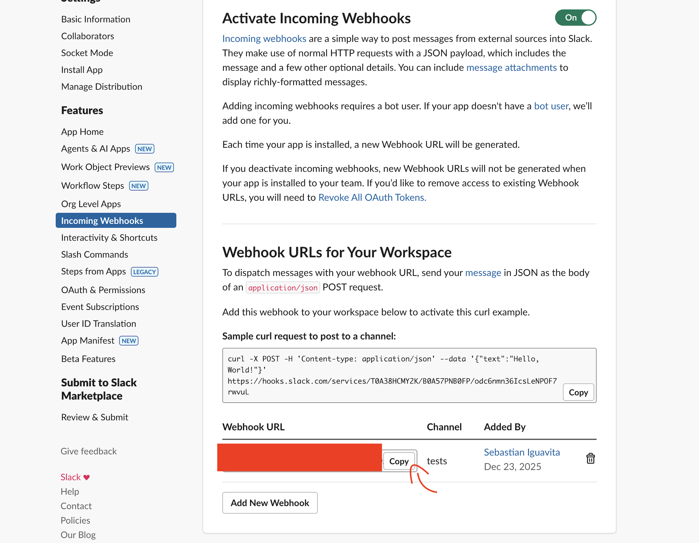
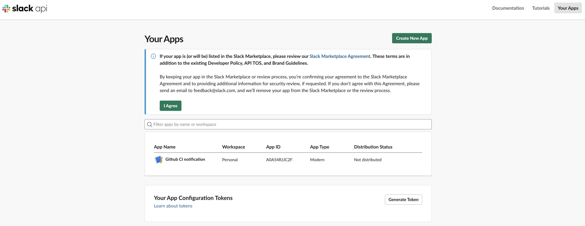

# SLACK-NOTIFICATION 

## Webhook URL 
- go to https://api.slack.com/apps
- create new app (select from scratch)
- set a name and the workspace
- in features section go to incoming webhooks and enable it
- copy the webhook url 

> [!NOTE]
> to modify the app created you must go to https://api.slack.com/apps and enter to your app

- in github create a secret for the URL, example path to go to the actions `https://github.com/githubuser/yourrepo/settings/secrets/actions`
- add a job to send notifications, check [JOB 3: NOTIFY SLACK](../.github/workflows/playwright-core.yml)

> [!NOTE]
> the free Slack package should be sufficient for the job notifications

> [!WARNING]  
> Bear in mind when executing the jobs locally via act, links will not work
